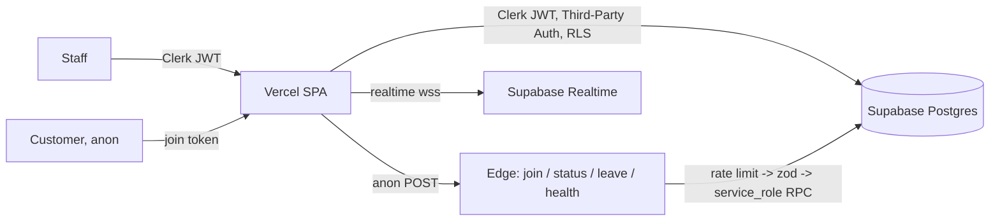

# QueueUp — Production Hardening

Status of the production-readiness program. Legend: **✅ Done** · **🟡 Partial** ·
**☁️ Platform-provided** · **📝 Planned**.

QueueUp was built production-minded from the start (zod validation, RLS, rate-limited
edge functions, react-query caching, error boundaries, structured logging, Vitest +
Playwright). This pass closed the remaining gaps: **idempotency, a join race condition,
security headers, and a dependency-scan gate.**

| Area                                      | Status | Where / How                                                                                                                                                                                                           |
| ----------------------------------------- | ------ | --------------------------------------------------------------------------------------------------------------------------------------------------------------------------------------------------------------------- |
| Idempotency (mutating API)                | ✅     | `queue_entries.idempotency_key` + partial unique `(queue_id, key)` (`0010_join_idempotency.sql`); `join_queue` replays the same entry for a repeated key; client sends a key per submit (`useJoinQueue`).             |
| Concurrency / race prevention             | ✅     | `join_queue` now takes a per-queue `pg_advisory_xact_lock` so concurrent joins can't collide on `position`; `on conflict do nothing` handles the idempotency race; staff status updates are optimistic + invalidated. |
| Retry with backoff                        | ✅     | `callEdgeWithRetry` (exponential backoff + jitter, transient-only) on the idempotent join.                                                                                                                            |
| Input sanitization / injection prevention | ✅     | Zod at the client **and** re-validated at the edge (`_shared/schemas.ts`); all writes go through `SECURITY DEFINER` RPCs; browser never touches `queue_entries`.                                                      |
| Authentication                            | ☁️✅   | Clerk (staff). Customer flow is intentionally anonymous (join token only).                                                                                                                                            |
| Authorization / roles / permissions       | ✅     | Clerk JWT → Supabase Third-Party Auth; RLS keyed on `auth.jwt()->>'sub'` via `private` SECURITY DEFINER helpers; owner-membership checks.                                                                             |
| Session management / token expiry         | ☁️✅   | Clerk-issued short-lived JWT; refresh + revoke handled by Clerk.                                                                                                                                                      |
| Secrets management                        | ☁️✅   | Service-role key only inside edge functions; client holds publishable keys (RLS-protected).                                                                                                                           |
| HTTPS / TLS / encryption                  | ☁️✅   | Vercel + Supabase TLS; encryption at rest; HSTS + `upgrade-insecure-requests` added.                                                                                                                                  |
| Rate limiting / abuse prevention          | ✅     | DB-backed limiter (`0005_rate_limiting.sql`, `_shared/ratelimit.ts`): 5 joins/min/IP, applied on every edge route.                                                                                                    |
| Dependency scanning / patching            | ✅     | CI `security` job: `npm audit --audit-level=high` (0 vulnerabilities today).                                                                                                                                          |
| Multi-tenancy / data isolation            | ✅     | RLS per business/owner; customer flow exposes only public business + open queues.                                                                                                                                     |
| PII handling                              | 🟡     | Name + optional phone + party size. No tracking. Phone optional and length-bounded.                                                                                                                                   |
| Data retention / deletion                 | 🟡     | Entries cascade on queue/business deletion. **Next:** scheduled purge of old terminal entries.                                                                                                                        |
| Audit trails / logging                    | ✅     | `activity` table records joins/leaves/status changes; `0008_activity_status_log.sql`; structured JSON logs in edge functions.                                                                                         |
| Security headers                          | ✅     | HSTS, X-Frame-Options, nosniff, Referrer-Policy, Permissions-Policy, COOP `same-origin-allow-popups` (Clerk-safe). CSP shipped **report-only** first (correct rollout; Clerk allow-list included) then enforce.       |
| Unit / integration tests                  | ✅     | Vitest (25 tests): schemas, sanitize, errors, logger, error-boundary; integration tests self-skip without Supabase env.                                                                                               |
| End-to-end tests                          | ✅     | Playwright (`e2e/`).                                                                                                                                                                                                  |
| Regression / CI enforcement               | ✅     | `.github/workflows/ci.yml`: lint, format, typecheck, tests, build, **+ dependency audit**, on every push/PR.                                                                                                          |
| Code review process / standards           | ✅     | ESLint + Prettier + strict TS + tests gate every change.                                                                                                                                                              |
| Error handling / graceful degradation     | ✅     | Error boundary + route-error UI; typed `ApiError`; polling fallback when realtime is unavailable.                                                                                                                     |
| Caching strategy / invalidation           | ✅     | TanStack Query with targeted `invalidateQueries`; optimistic updates; realtime ping refresh.                                                                                                                          |
| Circuit breaker / fallback                | ✅     | `src/lib/circuit-breaker.ts` wraps the join (opens after 5 fails, 15s cooldown, half-open trial); plus polling/realtime fallbacks.                                                                                     |
| RTO / RPO + DR                            | 🟡     | RPO ≤ 24h (Supabase backups/PITR); RTO ≤ 1h (stateless redeploy + restore). Runbook below.                                                                                                                            |
| Accessibility                             | 🟡     | Radix UI primitives (focus/ARIA), semantic structure, theme contrast. **Next:** full axe audit.                                                                                                                       |
| ADRs / architecture / API contract        | ✅     | Auth architecture in README + this doc; edge API contract below; ADRs summarized.                                                                                                                                     |

## ⚠️ One activation step

The migration (idempotency + race fix) is **live and backward-compatible** (the old
`join_queue` signature still works, so nothing broke). The client now sends an
idempotency key (harmlessly ignored until then). To make idempotency + the race fix
fully active end-to-end, redeploy the updated edge function:

```bash
supabase functions deploy join-queue
```

## Architecture (auth + write path)



## Disaster recovery (RTO / RPO)

- **RPO ≤ 24h** (Supabase daily backups; PITR tightens to minutes on paid tiers).
- **RTO ≤ 1h:** SPA redeploys from Git in minutes; DB restores from backup; migrations
  versioned in `supabase/migrations`; edge functions redeploy via `supabase functions deploy`.

## Edge API contract (summary)

| Route                | Auth       | Idempotent              | Limit     |
| -------------------- | ---------- | ----------------------- | --------- |
| `POST /join-queue`   | anon       | ✅ key                  | 5/min/IP  |
| `POST /entry-status` | join token | n/a (read)              | per-route |
| `POST /leave-queue`  | join token | ✅ (cancel is terminal) | per-route |
| `GET /health`        | none       | n/a                     | —         |

## ADRs (summary)

1. **Clerk + Supabase Third-Party Auth** — Clerk issues the JWT; Supabase trusts it; RLS reads `sub`.
2. **Anonymous customer flow via edge functions** — entries are never anon-readable; service-role RPCs only.
3. **Idempotency via per-queue key + advisory lock** — dedupe joins and remove the `position` race in one change.
4. **Polling + realtime ping** — reliable status for anon users without exposing rows.
