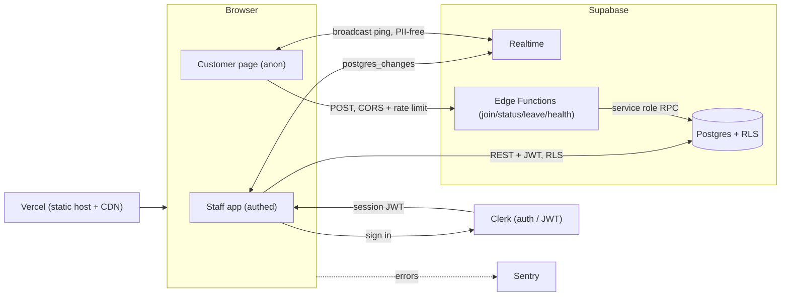
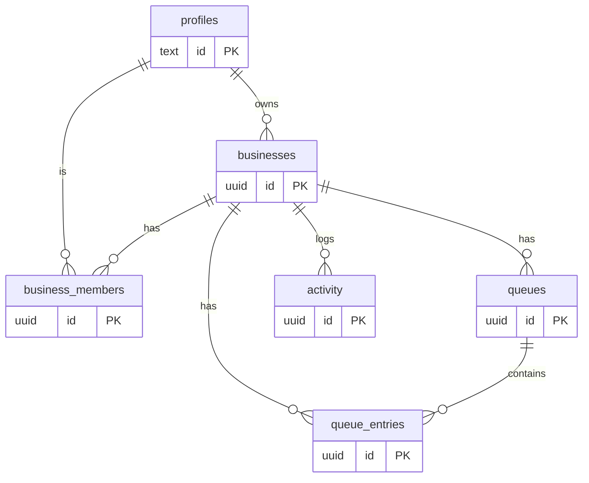

# QueueUp — a real-time virtual walk-in waitlist

> Replace the clipboard at the counter. Customers join your line from their phone by scanning a QR code, watch their **live position and ETA**, and your staff run the whole queue from one screen — updates sync in real time across every device.

[](https://github.com/basel-mahmoud/queueup/actions/workflows/ci.yml)
&nbsp;[](https://REPLACE_ME.vercel.app)
&nbsp;

<!-- HERO: drop a screenshot/GIF of the staff board + customer status side by side here -->
<p align="center"><em>📸 Add a hero screenshot/GIF here (staff board on the left, customer phone view on the right).</em></p>

---

## 🔗 Live demo

**App:** https://REPLACE_ME.vercel.app &nbsp;·&nbsp; **Try the customer flow (no login):** https://REPLACE_ME.vercel.app/q/snip-and-style

**Sign in with the demo account** (staff side):

| Email                                 | Password          |
| ------------------------------------- | ----------------- |
| `queueup.demo+clerk_test@example.com` | `QueueUpDemo123!` |

> The Clerk instance is in development mode; if prompted for an email code, use `424242`.

---

## What it does

- **🎟️ Join by QR — no app, no signup.** A customer scans the code at the counter and joins the line in two taps. Each gets a private, token-scoped status link.
- **⏱️ Live position & ETA.** Everyone sees exactly where they stand and how long the wait is, recalculated server-side and pushed in real time.
- **🧑‍💼 One staff dashboard.** Call next, start serving, mark served/no-show, add walk-ins. The board updates instantly across every open device.
- **🔐 Secure by construction.** Database-enforced authorization (Postgres RLS), validated inputs, CORS allow-list, rate limiting, and a customer flow where the browser **never touches the PII table** — all reads/writes go through rate-limited edge functions.

---

## Tech stack

| Layer            | Choice                                                                        |
| ---------------- | ----------------------------------------------------------------------------- |
| Language         | TypeScript (strict, `noUncheckedIndexedAccess`, `exactOptionalPropertyTypes`) |
| Frontend         | React 19 + Vite 8                                                             |
| Styling          | Tailwind CSS v4 + shadcn/ui (Radix primitives)                                |
| Data/state       | TanStack Query + Zustand                                                      |
| Forms/validation | React Hook Form + **Zod** (schemas shared client ↔ edge)                      |
| Backend          | Supabase — Postgres + RLS + Realtime + Edge Functions (Deno)                  |
| Auth             | **Clerk** (third-party-auth bridge to Supabase; JWT `sub` drives RLS)         |
| Hosting          | Vercel (auto-deploy on push to `main`, per-PR previews)                       |
| CI               | GitHub Actions (lint · format · typecheck · test · build)                     |
| Testing          | Vitest + React Testing Library (unit/integration)                             |
| Observability    | Sentry (DSN-gated) + structured, redacted logging                             |

---

## Architecture



The **staff app** talks to Postgres directly with the Clerk JWT — RLS decides what it can see. The **customer flow** never reads the database directly: it calls edge functions that validate, rate-limit, and run `SECURITY DEFINER` RPCs.

## Data model



Full schema, policies, indexes, triggers, and RPCs: [`supabase/migrations/`](supabase/migrations).

---

## 🛡️ Security & Reliability

The graded core. Each item below is implemented, tested where noted, and linked to the file that proves it.

### 1. Authorization — users touch only their own resources

```
Member A  ──▶  GET /businesses/123 (A is a member)      ──▶  ✅ rows returned
Member A  ──▶  GET /businesses/456 (A is NOT a member)  ──▶  ❌ empty (RLS denies)
anon      ──▶  GET /queue_entries (PII)                 ──▶  ❌ empty (no policy)
```

Enforced at the **database** with Postgres **Row-Level Security** — it holds even if an API handler has a bug. Every table has RLS enabled; policies key off the Clerk JWT (`auth.jwt() ->> 'sub'`) checked against `business_members` via `SECURITY DEFINER` helpers in a non-exposed `private` schema (avoids policy recursion). `queue_entries` (customer PII) is granted to **no anonymous role** — customer access flows only through service-role RPCs.

- Policies & helpers: [`supabase/migrations/0001_initial_schema.sql`](supabase/migrations/0001_initial_schema.sql), [`0003_harden_functions.sql`](supabase/migrations/0003_harden_functions.sql)
- **Proof:** integration test asserts anon cannot read `queue_entries` or write `businesses` — [`tests/integration/security.test.ts`](tests/integration/security.test.ts)

### 2. Input validation & sanitization — block injection

```
raw input ──▶ Zod (type + shape + bounds) ──▶ parameterized query ──▶ safe
                     └─ on failure ▶ 400, no DB call
```

Every input is validated with **Zod** on the client **and again at the edge** before any DB call. Queries use Supabase's parameterized builder exclusively (SQL injection is structurally impossible). User text renders as text by default; a DOMPurify allow-list neutralizes any rich HTML. All fields are length-bounded.

- Shared schemas: [`src/lib/schemas.ts`](src/lib/schemas.ts) · edge re-validation: [`supabase/functions/join-queue/index.ts`](supabase/functions/join-queue/index.ts) · sanitizer: [`src/utils/sanitize.ts`](src/utils/sanitize.ts)
- **Proof:** injection/XSS payload tests — [`src/lib/schemas.test.ts`](src/lib/schemas.test.ts), [`src/utils/sanitize.test.ts`](src/utils/sanitize.test.ts)

### 3. CORS — only approved origins reach the API

An explicit **allow-list** (production + preview + `localhost`); preflight handled; **no `Access-Control-Allow-Origin: *`** on any endpoint. Disallowed origins receive no ACAO header.

- [`supabase/functions/_shared/cors.ts`](supabase/functions/_shared/cors.ts)
- **Proof (manual):** `curl -H "Origin: https://evil.example" …/join-queue` returns no ACAO header.

### 4. Rate limiting — prevent abuse & runaway cost

```
request ──▶ limiter (key = IP, sliding window)
              ├─ under limit ▶ 200/201
              └─ over limit  ▶ 429 + Retry-After
```

A sliding-window limiter in shared edge middleware, keyed by IP, backed by a Postgres table in the `private` schema. Tighter limits on writes (join 5/min) than reads (status 60/min).

- [`supabase/functions/_shared/ratelimit.ts`](supabase/functions/_shared/ratelimit.ts) · [`supabase/migrations/0005_rate_limiting.sql`](supabase/migrations/0005_rate_limiting.sql)
- **Proof:** integration test fires N+1 requests, asserts `429` — [`tests/integration/security.test.ts`](tests/integration/security.test.ts)

### 5. Password-reset security — tokens expire

Auth is handled by **Clerk** (managed, single-use, short-TTL reset tokens; sessions invalidated on reset; identical responses regardless of whether the email exists, so no account enumeration). We never roll our own reset flow. Reset-request spam is bounded by the same rate-limit layer.

- Bridge config: [`src/features/auth/clerk-gate.tsx`](src/features/auth/clerk-gate.tsx), [`src/hooks/use-supabase.ts`](src/hooks/use-supabase.ts)

### 6. Frontend error handling — clean fallbacks, never a raw crash

```
render throws ──▶ Error Boundary ──▶ friendly fallback + Refresh
query error   ──▶ inline ErrorState (safe message)
both          ──▶ Sentry (scrubbed)
```

Top-level error boundary + per-route error elements; every query/mutation has explicit loading/error/empty states; global `unhandledrejection`/`onerror` handlers report to Sentry. Production never shows a stack trace.

- [`src/components/error-boundary.tsx`](src/components/error-boundary.tsx), [`src/components/route-error.tsx`](src/components/route-error.tsx), [`src/components/states.tsx`](src/components/states.tsx)
- **Proof:** test forces a render error and asserts the fallback (not the stack) appears — [`src/components/error-boundary.test.tsx`](src/components/error-boundary.test.tsx)

### 7. Database indexes — index hot query fields

Hot paths are indexed: `business_members(user_id)` and `(business_id,user_id)` (every RLS check), `queues(business_id,is_open)`, `queue_entries(queue_id,status,position)` and `(queue_id,created_at)`, `activity(business_id,created_at)`, plus the `activity.actor_id` FK.

- [`supabase/migrations/0001_initial_schema.sql`](supabase/migrations/0001_initial_schema.sql), [`0004_advisor_perf_fixes.sql`](supabase/migrations/0004_advisor_perf_fixes.sql)
- **EXPLAIN (board load — entries for a queue, ordered):**

```sql
EXPLAIN ANALYZE
SELECT * FROM queue_entries WHERE queue_id = $1 ORDER BY position;
-- Before idx_entries_queue_status_pos:  Seq Scan + Sort
-- After:                                Index Scan using idx_entries_queue_status_pos  (no sort)
```

### 8. Logging — structured, leveled, prod-visible, no secrets

JSON logs with a `correlationId` on every line; level by environment (DEBUG dev / INFO prod). A **redaction allow-list** scrubs passwords, tokens, JWTs, emails, phones, card data before emit.

- Client: [`src/utils/logger.ts`](src/utils/logger.ts) · edge: [`supabase/functions/_shared/respond.ts`](supabase/functions/_shared/respond.ts)
- **Proof:** redaction tests — [`src/utils/logger.test.ts`](src/utils/logger.test.ts)

### 9. Alerts — hear about issues before users do

Sentry alert rules (configure in the Sentry dashboard): (a) any new error type → email; (b) error volume ≥ 3 within 2h → email; (c) error-rate spike threshold. Plus this repo's scheduled **deploy smoke test** ([`.github/workflows/deploy-check.yml`](.github/workflows/deploy-check.yml)) that pings the app + `/functions/v1/health` every 6h and on demand.

- Wiring: [`src/lib/monitoring.ts`](src/lib/monitoring.ts) · health probe: [`supabase/functions/health/index.ts`](supabase/functions/health/index.ts)

### 10. Rollback plan — one bad deploy ≠ an incident

See the [Rollback Runbook](#rollback-runbook). Vercel deployments are immutable (instant promote-previous); `main` is always deployable (revert via `git revert`, never force-push); every migration ships with a tested down path ([`supabase/migrations/0001_initial_schema.down.sql`](supabase/migrations/0001_initial_schema.down.sql)).

---

## Local setup

**Prerequisites:** Node 22+, a Supabase project, a Clerk application connected to Supabase as a third-party auth provider.

```bash
git clone https://github.com/basel-mahmoud/queueup.git
cd queueup
npm install
cp .env.example .env.local   # then fill in the values (see .env.example)
npm run dev                  # http://localhost:5173
```

Database migrations live in [`supabase/migrations/`](supabase/migrations) and seed data in [`supabase/seed.sql`](supabase/seed.sql); apply them with the Supabase CLI or dashboard. Regenerate types after schema changes:

```bash
supabase gen types typescript --project-id <ref> > src/types/supabase.ts
```

## Testing

```bash
npm run test:run        # unit + integration (integration self-skips without Supabase env)
npm run test:coverage   # with coverage
```

Covered: Zod validation incl. injection/XSS payloads, log redaction, error helpers, the error boundary's safe fallback, and live RLS-denial + rate-limit (429) integration checks.

## CI/CD

[`.github/workflows/ci.yml`](.github/workflows/ci.yml) runs **lint → format check → typecheck → test → build** on every push and PR. Merging to `main` triggers a Vercel production deploy; every PR gets an immutable preview URL. [`deploy-check.yml`](.github/workflows/deploy-check.yml) smoke-tests the live deployment.

## Rollback Runbook

**App (fastest):** roll back the app first.

```bash
vercel rollback           # promote the previous deployment (instant, no rebuild)
# or in the Vercel dashboard: Deployments → previous → Promote to Production
```

**Git:** `git revert <sha> && git push` — never force-push shared history.
**Database (only if a migration must be undone):** back up first, then apply the down migration:

```bash
psql "$DATABASE_URL" -f supabase/migrations/0001_initial_schema.down.sql
```

Order: roll back the app, then the DB if needed.

## Roadmap

- Invite staff by email (edge function + Clerk lookup)
- SMS "you're up" notifications (Twilio)
- Per-business analytics (avg wait, no-show rate)
- Premium tier (Stripe) — multiple concurrent queues

## License

MIT — see [LICENSE](LICENSE).
